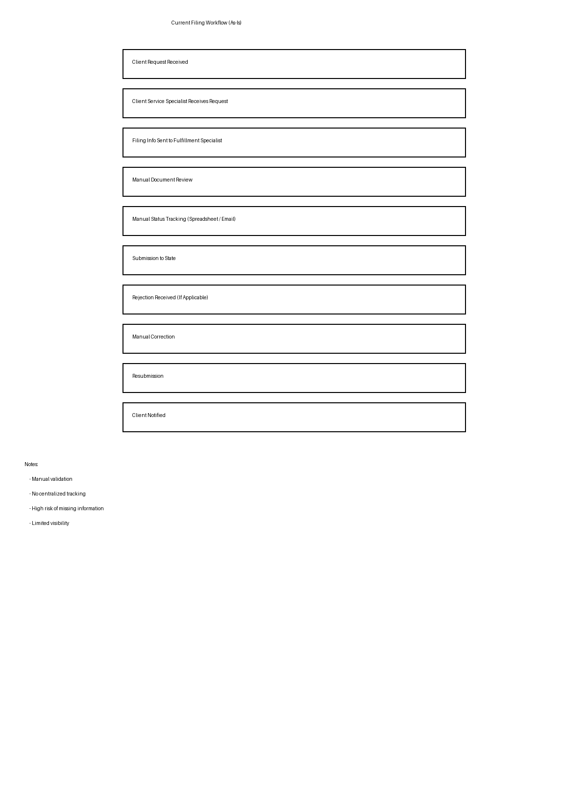
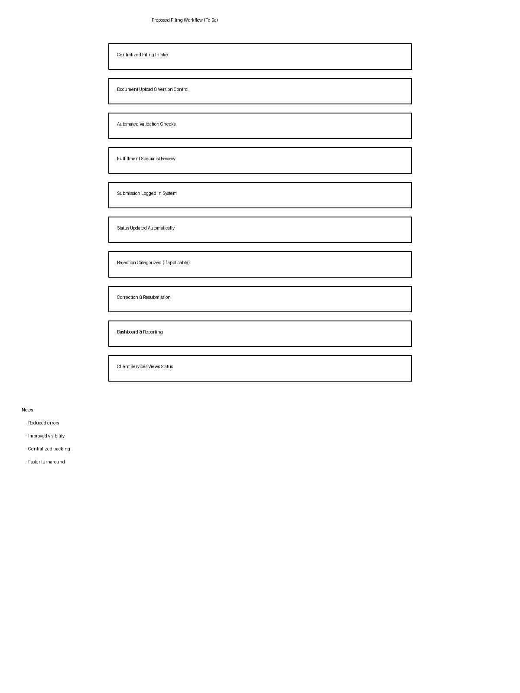

# 🏢 Business Filing Workflow System Analysis  
*(Systems Analysis & SDLC Project)*

> Designed and optimized a compliance-driven business filing workflow using system design principles, requirements engineering, and process improvement techniques.

> ⚠️ **Note:** This project is inspired by real-world operations. All details have been generalized to maintain confidentiality.

---

## 📌 Project Overview
This project analyzes a business filing workflow and redesigns it into a structured, scalable system.

The focus is on identifying inefficiencies in manual processes and transforming them into a modern workflow that improves **accuracy, visibility, and operational efficiency**.

This project demonstrates the ability to bridge **business processes and technical system design**.

---

## 🎯 Objectives
- Analyze an existing filing workflow and identify inefficiencies  
- Design an optimized “To-Be” system model  
- Define functional and non-functional requirements  
- Improve workflow visibility, validation, and tracking  
- Translate business processes into implementable system design  

---

## 🧩 Problem
Manual filing workflows often result in:

- High rejection and resubmission rates  
- Poor visibility into filing status  
- Data entry errors and inconsistent validation  
- Fragmented tracking across tools  
- Lack of standardized reporting  

---

## 💡 Solution
Designed a centralized workflow system with:

- Standardized intake and processing stages  
- Automated validation logic  
- Document version control  
- Status tracking with audit history  
- Structured rejection handling and reporting  

---

## 🔄 Workflow Design

### As-Is Workflow


### To-Be Workflow


---

## 📂 Project Deliverables
- `docs/system-requirements-document.docx` – system requirements documentation  
- `docs/user-stories-backlog.xlsx` – backlog and user stories  
- `visuals/as-is-workflow.png` – current-state workflow diagram  
- `visuals/to-be-workflow.png` – improved workflow diagram  

---

## ⚙️ System Design Approach
This project follows core **SDLC** practices:

1. **Requirement Analysis**  
   - Identified workflow inefficiencies  
   - Defined business and system needs  

2. **System Design**  
   - Created improved workflow structure  
   - Standardized processing stages  

3. **Planning & Backlog Creation**  
   - Developed user stories  
   - Prioritized implementation tasks  

4. **Process Optimization**  
   - Reduced bottlenecks  
   - Improved workflow clarity and consistency  

---

## 📊 Key Improvements
- Reduced workflow ambiguity through standardized process design  
- Improved visibility into filing lifecycle and ownership  
- Minimized errors through validation-oriented workflow redesign  
- Enabled stronger reporting through clearer workflow structure  
- Translated a manual process into an implementation-ready system model  

---

## 📋 System Features

### Functional Features
- Filing intake and record creation  
- Document upload and versioning  
- Validation of required fields  
- Status tracking and audit logs  
- Rejection categorization  
- Reporting and metrics  

### Non-Functional Features
- Scalable workflow design  
- Data integrity and traceability  
- Consistent process structure  
- Maintainable architecture  

---

## 🧠 Skills Demonstrated
- Systems Analysis & Design  
- SDLC (Software Development Life Cycle)  
- Workflow Optimization  
- Requirements Engineering  
- Business Process Modeling  
- Technical Documentation  

---

## 💻 Technical Perspective
This project demonstrates how business workflows can be translated into technical systems.
The design supports implementation as a full-stack application:

- **Backend:** workflow processing and validation  
- **Database:** filing, document, and status tracking  
- **Frontend:** intake and tracking interface  
- **API Layer:** workflow and reporting endpoints  

---

## 🔧 API Design (Conceptual)

```http
POST   /api/filings
GET    /api/filings/{id}
PUT    /api/filings/{id}/status
POST   /api/filings/{id}/validate
GET    /api/reports
```
This API structure demonstrates how the workflow system can be translated into a scalable backend service.

---


## 🗄️ Database Schema (Conceptual)

The system is designed using a relational database structure:

### Tables

**Filings**
- filing_id (Primary Key)
- entity_name
- filing_type
- status
- submission_date

**Documents**
- document_id (Primary Key)
- filing_id (Foreign Key)
- file_name
- version
- uploaded_at

**Users**
- user_id (Primary Key)
- name
- role

**Rejections**
- rejection_id (Primary Key)
- filing_id (Foreign Key)
- reason
- timestamp

This schema supports structured data storage, audit tracking, and reporting capabilities.

---

## 🏗️ System Architecture
- Frontend: Filing intake & tracking interface
- Backend: Workflow logic and validation
- Database: Structured storage and audit tracking
- Workflow Engine: Handles status transitions and rules
- Reporting Layer: Supports operational insights

This architecture supports scalability, modularity, and real-time workflow tracking.

---

## 🚀 Future Improvements
- Build a full-stack workflow application
- Add dashboard visualizations
- Implement automated validation checks
- Add SLA monitoring and alerts
- Expand analytics for rejection trends

---

## 💡 What This Project Shows
- Ability to analyze and improve real-world workflows
- Strong understanding of system design and SDLC
- Experience translating business problems into technical solutions
- Capability to design scalable, implementation-ready systems
